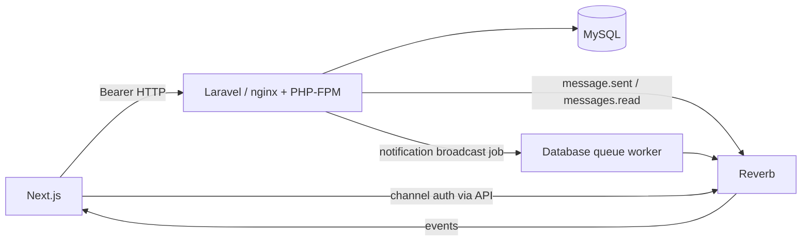

# Architecture and conventions

Audited 2026-09-17; updated through Day 4 on 2026-09-20. This describes the current implementation; proposed changes are separated in [DEVELOPMENT_PLAN.md](../DEVELOPMENT_PLAN.md). Implemented does not mean production-ready or fully tested. [SECURITY.md](SECURITY.md) records the security decisions, verification and remaining rollout work.

## Technology inventory

| Dependency | Current manifest constraint | Current lockfile version |
| --- | --- | --- |
| Next.js | 15.5.25 | 15.5.25 |
| React / React DOM | ^18.3.1 | 18.3.1 |
| TypeScript | ^5 | 5.6.2 |
| Tailwind CSS | ^3.4.1 | 3.4.11 |
| Axios | 1.20.0 | 1.20.0 |
| sharp | 0.35.4 | 0.35.4 |
| ESLint / eslint-config-next | ^8 / 15.5.25 | 8.57.0 / 15.5.25 |
| Laravel framework | ^12.61.1 | 12.69.2 |
| Passport / Reverb / Socialite | ^12.4.3 / ^1.0 / ^5.24.3 | 12.4.3 / 1.11.1 / 5.30.0 |
| PHPUnit / Pint | ^11.0.1 / ^1.13 | 11.5.56 / 1.18.1 |
| Laravel Echo / pusher-js | ^1.16.1 / ^8.4.0-rc2 | 1.16.1 / 8.4.0-rc2 |
| Server Vite / Laravel Vite plugin | 6.4.3 / 1.3.0 | 6.4.3 / 1.3.0 |

Node is constrained to `^22.23.2`, with `.nvmrc` selecting `22.23.2`. PHP remains constrained to `^8.2`. Docker pins Node `22.23.2-alpine3.24`, PHP `8.2.33-fpm-bookworm`, Composer `2.10.3`, nginx `1.30.5-trixie` and MySQL to exact multi-platform image digests. The disposable database defaults to `8.4.11`; normal development retains `8.0.46` pending an explicit cutover. These pins require deliberate maintenance; system packages installed from apt are not snapshot-pinned. PHP 8.2 has security support only through December 2026; MySQL 8.0 is EOL. Day 4 verifies an 8.4 logical restore using synthetic data, without upgrading an existing development volume. [Database](DATABASE.md) separates compatibility evidence from remaining production patch/cutover gates.

Day 3 full and production-only npm audits for both JavaScript lockfiles, and full and production-only Composer audits, report zero findings. This is a dependency-advisory snapshot, not an application or OS security certification. [DEPENDENCIES.md](DEPENDENCIES.md) records the explicit upgrades and two scoped npm overrides: Next's PostCSS and typescript-estree's minimatch. Next 15, React 18, Passport 12 and Reverb remain in place.

## Repository map

```text
client/
  src/app/              Next routes, layouts, loading boundaries
  src/components/       Shared social/navigation UI; ui/ media components
  src/context/          Authentication, notifications, generic selection state
  src/hooks/            Feature state, data fetching, Echo/presence lifecycle
  src/lib/              Feature API, token, realtime, formatting helpers
  src/utils/            Shared Axios HTTP transport
  public/               Icons, branding, default avatar
server/
  bootstrap/            Application, route and middleware registration
  routes/               api, user, post, message, group, channels, web, console
  app/Http/             Controllers and Form Requests
  app/Services/         Business operations and access checks
  app/Repositories/     Eloquent query and persistence helpers
  app/Models/           Entities and relationships
  app/Events/           Immediate message/read broadcasts
  app/Notifications/    Database and broadcast notifications
  app/Traits/           UUID and response helpers
  config/               Environment-backed configuration
  database/             Migrations, valid factories, guarded demo fixtures
  tests/                PHPUnit tests; isolated MySQL invariant/race/snapshot scripts
  resources/            Welcome page and Laravel Vite scaffold
  docker/, nginx/       Startup, upload limits, web-server configuration
scripts/                Node HTTP/WebSocket integration suites
docs/                   Architecture, contracts, workflow, audit
```

Client and server have independent dependency trees and lockfiles. There is no monorepo task runner, generated API client, or shared schema package. Laravel's Vite bundle is separate from Next.js.

## Frontend and routes

The root layout supplies fonts, global CSS, toast feedback and React providers. Screens are largely client components calling Laravel directly. There are no Next route handlers implementing product APIs. `middleware.js` redirects selected routes if the token cookie is absent; it does not validate tokens or replace backend authorization.

| Route | Responsibility |
| --- | --- |
| `/` | Social feed and pagination |
| `/signin`, `/signup` | Password authentication |
| `/forget-password`, `/reset-password` | Recovery request and reset form |
| `/create-post`, `/post/[postId]` | Publish and inspect posts/comments |
| `/chat`, `/chat/[id]` | Conversation cards and direct chat; `id` is the peer user ID |
| `/groups`, `/groups/[id]` | Membership list and group chat |
| `/[name]` | Username profile and posts; API access still requires authentication |
| `/settings`, `/settings/change-profile`, `/settings/change-password` | Account settings |
| `/notifications` | Notification history and read actions |

React contexts hold authentication, notifications, and generic selected data. Hooks and component state manage fetching, forms, pagination, optimistic updates, and realtime reconciliation. No Redux, Zustand, React Query, or SWR is installed. This custom state logic is useful but has stale-request and lifecycle risks. The local-storage `user` entry supplies a cached `authUser` snapshot, not authoritative identity; hydration revalidates the token through `/auth/me`, including when that cache is absent.

Feature functions in `src/lib/` use `src/utils/fetcher.js`. The transport attaches bearer tokens and the current socket ID and rejects HTTP errors. Public password endpoints treat 401 as a credential failure; protected endpoints clear expired sessions and redirect to sign-in, with a token comparison preventing an old request from clearing a newer session. UI callers must display failures. Private chat attachments use authenticated binary requests and revocable browser blob URLs; supplied attachment URLs are not trusted as bearer-token destinations.

### Component and styling conventions

- Route files compose screens and interpret parameters. Reusable UI belongs in `components/`, data/lifecycle logic in hooks, and API contracts in `lib/`.
- Keep the `@/` alias to `src/`, PascalCase component names and `useX` hooks. Avoid mass renames or unrelated formatting during bug fixes.
- Tailwind utilities provide layouts/breakpoints. Flowbite is installed and configured in Tailwind, but no active UI imports were identified. Multiple icon approaches coexist. Audit dependencies before removing them.
- Global CSS supplies the reset, gray background, scrollbar helpers and like animation. Geist fonts are loaded, but the body currently specifies Arial; theme variables do not form a complete design system.
- Desktop uses a sidebar; mobile uses bottom navigation. Nested chat panes and fixed heights require verification for small screens, scroll containment and safe-area overlap.
- Every interactive flow should provide loading, empty, success and error states, visible focus and labels. Links navigate; buttons act. These are adoption conventions, not a claim all current components comply.

Most source is JavaScript/JSX. Passing TypeScript checks does not prove whole-frontend type safety: `checkJs` is off. Adopt types feature by feature.

Day 3 restores Next.js image optimization after upgrading sharp to `0.35.4`. The image allowlist derives the public API origin from build-time `NEXT_PUBLIC_BACKEND_URL` and permits only `/storage/uploads/avatars/**`, `/storage/uploads/posts/**` and `/storage/uploads/groups/**` beneath its deployment path, without query strings. The existing `static.xx.fbcdn.net` HTTPS origin remains allowed. SVG optimization stays disabled. Local raster assets use the same optimizer, and Next Image continues generating responsive image candidates.

The configured public origin must match Laravel's `APP_URL` storage URLs and be reachable from both the browser and the Next server. Container-local `localhost` cannot reach a separate API container. The separate development client Compose therefore defaults `ELEVATEU_UNOPTIMIZED_IMAGES=true`; override it to `false` with a shared reachable API origin to exercise optimization. Host development and production builds default to optimization enabled; see [Development](DEVELOPMENT.md#client). Private message attachments retain bearer-authenticated downloads and browser blob rendering with an explicit image-MIME allowlist. Neither their API URLs nor legacy public message paths are allowed as remote optimizer inputs.

## Backend and API organization

`bootstrap/app.php` mounts `routes/api.php` plus user/post/group/message routes under `/api`. Controllers validate inputs and obtain the actor; services handle operations/access checks; repositories build queries. Profiles and notifications also use Eloquent directly in controllers. Layering is partial; the disabled social-login controller does not call a provider or link accounts.

Laravel's container injects concrete repositories and services. There is no consistent Policy/API Resource layer, command bus, or microservice boundary. Keep meaningful query helpers; avoid pass-through abstractions solely for symmetry.

Use Form Requests or inline validation with allowlisted fields. Derive actor/owner identity from `$request->user()`. Enforce ownership/membership server-side. Registration, post creation and message creation use transactions; upload cleanup compensates for failed writes where implemented. File deletion and database transactions are not atomic together.

Routes mix singular writes (`/post`, `/group`) and plural reads (`/posts`, `/groups`); preserve compatibility for now. [API.md](API.md) records actual routes and response exceptions. Framework errors are JSON on `/api/*`, but not all use the application's response envelope. API middleware adds private/no-store caching, no-sniff and no-referrer headers to returned responses. The baseline rate limit resolves Passport's `api` guard explicitly: 120 requests/minute per authenticated user, otherwise per IP. Registration, login and both recovery endpoints additionally share a 10 requests/minute per-IP budget. Production needs a shared persistent cache for limits across workers.

## Authentication flow

1. Registration validates inputs and creates a hashed-password user, profile and Passport personal access token in one database transaction. Token-issuance failure rolls the registration back.
2. Login checks the hash and issues the token within a transaction holding a user-row lock. The client stores the token in a JavaScript-readable `token` cookie, caches the user in local storage, and updates context.
3. API requests attach `Authorization: Bearer ...`. The Passport `api` guard validates it, including private/presence channel authorization.
4. Logout revokes the current token. Password change rechecks the password under a user-row lock and atomically updates the password/revokes other tokens. Reset locks the broker token row and changes the password, revokes all tokens and consumes the reset token transactionally. Personal access tokens expire after 30 days. No client refresh-token flow exists. SQLite tests cover behavior; parallel MySQL contention remains a separate verification gap.
5. Laravel's password broker sends reset links to `FRONTEND_URL/reset-password`. Recovery requests return the same message for known/unknown accounts, including mail failures, which are reported internally. Invalid, unknown and expired reset credentials share one error message. Auth email validation explicitly rejects ASCII control characters. With `MAIL_MAILER=log`, mail goes into logs; that does not verify real delivery.

Google/Facebook redirect and callback routes now fail closed with 503; unsupported providers return 404. The previous stateless, email-based linking implementation was unsafe and has been removed. Socialite remains installed, but social sign-in is unavailable until state/nonce validation, provider-subject identity, explicit account linking and a safe frontend handoff are implemented. Email verification and MFA are absent. The existing JavaScript-readable bearer cookie remains exposed if XSS occurs; an HttpOnly session migration requires coordinated cookie, CSRF and realtime design and is not implemented.

## Database architecture

| Entity/table | Relationships and constraints |
| --- | --- |
| `users` | UUID; unique username/email; password and admin flag |
| `profiles` | UUID associated with user; names, bio, avatar URL, location, birthdate |
| `posts` | UUID, author, nullable media-only content; comments/likes/attachments |
| `comments` | UUID, author, post, content |
| `likes` | UUID; unique `(user_id, post_id)` added later |
| `conversations` | UUID, two participants, nullable last-message pointer |
| `groups`, `group_users` | UUID group with owner; timestamped membership pivot |
| `messages` | UUID, sender, receiver/conversation or group, read timestamp, optional client UUID |
| `file_attachments` | UUID, post/message relationship, path/name/MIME/size |
| `notifications` | UUID notifiable identity, JSON data and read timestamp |
| Framework tables | Password resets, sessions, cache/locks, jobs/batches/failed jobs, Passport OAuth |

`GeneratesUuid` assigns domain identities. Most relationships cascade deletes. There are no goal, milestone, check-in, challenge, streak or analytics tables.

The 2024 migrations establish social/Passport tables. July 2026 migrations support media-only posts, add feed indexes and like uniqueness, add message idempotency/read columns, create notifications and introduce microsecond timestamps. Feed/history use timestamp plus UUID ordering and offset pagination. Microseconds improve ordering but cannot guarantee unique timestamps or prevent pagination drift during concurrent writes.

September 2026 migrations enforce at most one profile per user, unique `(group_id,user_id)` membership and one conversation per unordered participant pair. Conversations retain their original participant columns/IDs and add virtual lowercase `participant_low` / `participant_high` columns with a unique index and distinct-participant CHECK. New application writes use `ConversationParticipants::ordered`; existing reversed rows remain readable without rewriting history. Mutually exclusive attachment/message targets and ancillary OAuth UUID types remain unresolved. Applied migrations and populated databases must never be rewritten/reset to make constraints pass.

[DATABASE.md](DATABASE.md) inventories table keys, indexes, deletion behavior and the migration procedure. `elevateu:db-preflight` runs 50 SELECT-only data checks plus schema metadata inspection in a read-only MySQL snapshot. It distinguishes schema enforcement, migration blockers, other data violations, warnings and informational references. `ConstraintReadiness` gates all three new migrations before any of their DDL, with no data repair. Group deletion still retains targetless messages; access is denied while preflight flags the retention issue.

The peer-card GET is read-only. The first POST `/messages` creates/resolves its conversation inside the message transaction. `UniqueResource` performs lookup, attempted insert and recovery only for the expected unique key. A savepoint protects an outer transaction; recovery uses a current locking read because an ordinary InnoDB repeatable-read query may retain the initial empty snapshot. The database decides the winner; profile, membership and conversation repositories return that resource without overwriting it. Message-service recovery handles the separate sender/client UUID key after transaction rollback and rechecks authorization. Unexpected database errors still fail, with a generic API response and a log containing exception class and driver codes only.

Factories now generate coherent related records and real synthetic media. Bare `User::factory()` remains available for missing-profile tests; `withProfile()` is the complete-account contract. Default seeding is a no-op. Explicit `DemoSeeder` requires local/testing, enablement, a supplied password and an allowlisted isolated database. It inserts missing deterministic records, preserves existing content/passwords and refuses collisions; no broadcasts or real mail are sent.

Post/profile/group images use Laravel's public disk and `/storage`; legacy committed post images also exist in `server/public/uploads/posts`. New message attachments use the private `message_attachments` disk rooted at `storage/app/private/messages`. Their URLs point to authenticated `/api/message-attachments/{id}`; the controller rechecks direct participants/current group membership, validates the stored path and forces a no-store, no-sniff download. The browser explicitly renders approved image blobs. The unused local disk's temporary signed serving is disabled.

Existing attachment rows retain their paths. During migration, authenticated downloads can read a legacy public copy if its private copy is absent. nginx denies both historical public message prefixes, with equivalent Apache rewrite rules supplied. `media:privatize-messages` inventories by default; `--apply` copies, verifies SHA-256 and then deletes each public source without changing database rows. Normal development data has not been migrated by the audit. Back up and move existing files before serving through another static server such as `php artisan serve`; the fallback alone does not make public copies private. Already downloaded/cached copies cannot be revoked.

## Realtime architecture



Message/read events broadcast immediately. Activity notifications persist in the database and broadcast through the queue. `X-Socket-Id` with `toOthers()` avoids a sender receiving its own event. Persistence can succeed before broadcast fails, so a failed HTTP response does not necessarily mean a rolled-back write.

| Channel | Access | Purpose |
| --- | --- | --- |
| `conversations.{id}` | Either participant | Message/read events, typing whispers |
| `groups.{id}` | Member at subscription | Group messages |
| `online` | Authenticated presence | Online-user cards |
| `App.Models.User.{id}` | Matching owner | Activity notifications |

The client uses an Echo singleton, token-reactive hook and shared presence subscription. Account changes, reconnects and missed events remain key regression targets. Membership is checked at subscription; removing a member does not prove an already-open connection is revoked. Day 5 repeats deterministic two-process MySQL races for reverse-direction first messages, membership, profile and same-client-UUID first-message retries. Each losing insert recovers one resource; retries do not repeat database notifications or event dispatches. Separate live suites verify Reverb, queued notifications, typing, read receipts and socket exclusion. Persistence and post-commit event delivery are still not atomic.

## Deployment boundary

Local Compose provides nginx, MySQL and an application container with PHP-FPM/Reverb/queue worker under Supervisor. The client has a standalone image and a separate development Compose file. Public frontend variables are baked into its build. Internal broadcast publishing and public WebSocket endpoints can differ.

The client image runs as a non-root user. The server retains a root Supervisor/FPM master and root Reverb/queue workers; changing that process model requires a separate permissions review. Its build context excludes environment files, Passport private keys, logs and private message storage. Build dependencies and Composer remain in the server image. Day 3 verified both image builds, but did not audit every operating-system package or redesign deployment.

Day 4 adds a verified synthetic logical backup/restore drill and a manual upgrade/rollback runbook. The repository still has no production hosting implementation, CI gate, TLS termination, production backup service, monitoring or automated deployment rollback. The existing topology is a development baseline.
